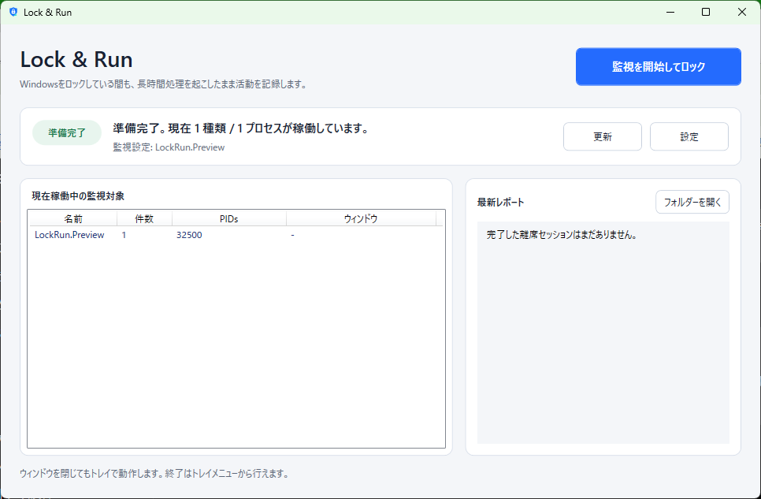

# Lock & Run

[](https://github.com/tatsukichiba/lock-and-run/actions/workflows/dotnet-build.yml)
[](https://github.com/tatsukichiba/lock-and-run/releases/latest)
[](LICENSE)

**Windowsをロックしている間も、長時間のAI・ビルド処理を起こしたまま活動を記録するトレイアプリです。**

Windowsの画面ロック自体は通常、実行中の処理を止めません。しかし自動スリープに入ると処理が止まることがあります。Lock & RunはWindowsへスリープ防止を要求してから標準ロック画面を開き、離席中の対象プロセスを定期記録します。

[最新版をダウンロード](https://github.com/tatsukichiba/lock-and-run/releases/latest) · [English](#english)



## できること

- 標準のWindowsロック画面を使用してPCをロック
- ロック中だけシステムの自動スリープを抑止
- 実際のロック通知を確認してから監視を開始
- 数秒間隔で監視対象のプロセスとCPU時間を記録
- 離席中に開始・終了した短時間プロセスも検出
- 復帰時に継続・終了・新規検出・CPU時間増加をレポート
- レポート履歴を自動保存
- 保存済みレポート履歴を確認付きで一括削除
- 実行中のプロセスを自動検出し、検索・選択して監視対象へ追加
- 日本語・英語表示と監視対象を設定画面から変更
- 同時に複数起動せず、既存ウィンドウを前面表示

## 使い方

1. [最新のRelease](https://github.com/tatsukichiba/lock-and-run/releases/latest)から `LockRun-vX.Y.Z-win-x64.zip` をダウンロードします。
2. ZIPを展開し、`LockRun.exe`を起動します。
3. 必要なら「設定」から監視するプロセス名を変更します。
4. 「監視を開始してロック」を押します。
5. Windowsへ戻るとスリープ防止が解除され、離席レポートが表示されます。

.NETの別途インストールは不要です。Windows SmartScreenが表示された場合は、発行元とダウンロード元を確認してから実行してください。

ReleaseにはSHA-256チェックサムとGitHub Actionsのビルド証明を添付します。GitHub CLIを利用できる場合は、ダウンロードしたZIPを次のように検証できます。

```powershell
gh attestation verify LockRun-vX.Y.Z-win-x64.zip --repo tatsukichiba/lock-and-run
```

この証明は配布物の生成元と改ざんの有無を確認するもので、Windowsのコード署名を置き換えるものではありません。

## 安全性と動作

Lock & Runは独自のロック画面やパスワード入力画面を作りません。Windowsの `LockWorkStation` APIを使用するため、認証は通常のWindowsサインインに任せます。

スリープ防止には理由付きのWindows Power Requestを使用します。ロックが15秒以内に確認できない場合、復帰した場合、アプリを終了した場合は電源要求を解除します。ディスプレイの点灯は要求しないため、ロック後に画面を消灯できます。

## レポートについて

レポートは以下を活動の目安として記録します。

- 開始時から動き続けているプロセス
- 離席中に終了したプロセス
- 離席中に新しく現れたプロセス
- 復帰前に開始・終了したプロセス
- プロセスごとのCPU時間増加
- Lock & Run自身のメモリ・CPU時間差分

CPU時間の増加は「処理活動が観測された」ことを示しますが、AIタスクの成功や成果物の正しさを保証するものではありません。

## 設定と保存先

設定画面では次を変更できます。

- 表示言語: 自動・日本語・英語
- 監視するWindowsプロセス名
- 実行中のプロセスを検索・選択して監視対象へ追加
- サンプリング間隔: 2～60秒
- 保存するレポート数: 1～100件

ユーザー設定: `%LocalAppData%\LockRun\appsettings.json`

レポート履歴: `%LocalAppData%\LockRun\Reports`

メイン画面からレポートフォルダーを開けます。「履歴を削除」を選ぶと確認画面が表示され、Lock & Runが保存したレポートだけを一括削除します。

初期監視対象にはCodex、Claude、Ollama、Python、Node.js、VS Code、Cursor、PowerShell、WSL、Unityなどが含まれます。同じ名前の複数プロセスは画面上でまとめて表示され、レポート内部ではPIDごとに追跡されます。

## 制限事項

- スリープ防止はWindowsの電源ポリシーに従うベストエフォートです。
- 手動スリープ、シャットダウン、Windows Update、蓋を閉じる操作、企業ポリシー、ハードウェア電源イベントは上書きできません。
- Modern Standby端末のバッテリー駆動ではWindowsが電源要求を制限する場合があります。
- 実行ファイルはAuthenticode未署名のため、SmartScreen警告が表示される場合があります。Release ZIPはGitHubのビルド証明とSHA-256で検証できます。
- 現時点ではGPU利用率やAI固有の完了状態は判定しません。

## 開発

必要環境:

- Windows 11
- .NET 8 SDK以上

```powershell
dotnet restore LockRun.sln
dotnet build LockRun.sln --configuration Release
dotnet test tests/LockRun.Tests/LockRun.Tests.csproj --configuration Release
```

ローカル発行:

```powershell
dotnet publish src/LockRun/LockRun.csproj `
  --configuration Release `
  --runtime win-x64 `
  --self-contained true `
  -p:PublishSingleFile=true `
  -p:IncludeNativeLibrariesForSelfExtract=true `
  -p:EnableCompressionInSingleFile=true `
  --output publish/LockRun-win-x64
```

`v*`タグをpushすると、GitHub Actionsがビルド、テスト、ZIP検証、SHA-256生成、GitHub Releaseへの添付を自動実行します。

## 実機確認

CIでは集計ロジックと電源要求の作成・解除をテストします。実際のロック、解除、自動スリープ、バッテリー駆動、Modern Standbyの挙動はWindows実機で確認してください。

## English

**Lock your Windows PC, keep long-running jobs awake, and see what was active while you were away.**

Lock & Run is a Windows 11 tray app for local AI agents, builds, scripts, and other long-running jobs. It creates a reasoned Windows power request, opens the real Windows lock screen, samples configured processes while the session is locked, and clears the request as soon as you return.

### Quick start

1. Download `LockRun-vX.Y.Z-win-x64.zip` from the [latest release](https://github.com/tatsukichiba/lock-and-run/releases/latest).
2. Extract the ZIP and run `LockRun.exe`.
3. Optionally choose process names and a sampling interval in Settings.
4. Select **Monitor and lock**.
5. Unlock Windows to receive the activity report.

The release is self-contained; a separate .NET installation is not required.

Saved report history can be opened or deleted from the main window. Deletion requires confirmation and only removes report files created by Lock & Run. The settings window can discover currently running processes so selected names can be added without replacing existing monitoring settings.

Release archives include a SHA-256 checksum and GitHub Actions build provenance. With GitHub CLI installed, verify a downloaded ZIP with:

```powershell
gh attestation verify LockRun-vX.Y.Z-win-x64.zip --repo tatsukichiba/lock-and-run
```

The attestation verifies provenance and integrity; it does not replace Windows code signing.

### Important limitations

- Sleep prevention is best effort and remains subject to Windows power policy.
- Manual sleep, lid close, shutdown, updates, enterprise policy, and hardware power events can override the request.
- CPU-time growth is an activity signal, not proof that an AI task completed successfully.
- The executable is not Authenticode-signed, so SmartScreen may warn on first launch. Release ZIPs can be checked with GitHub build provenance and SHA-256.

## License

[MIT](LICENSE)
